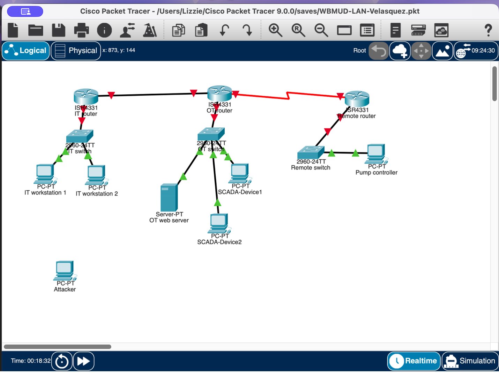
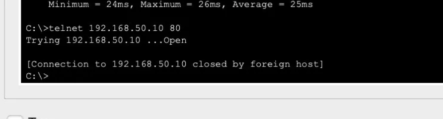
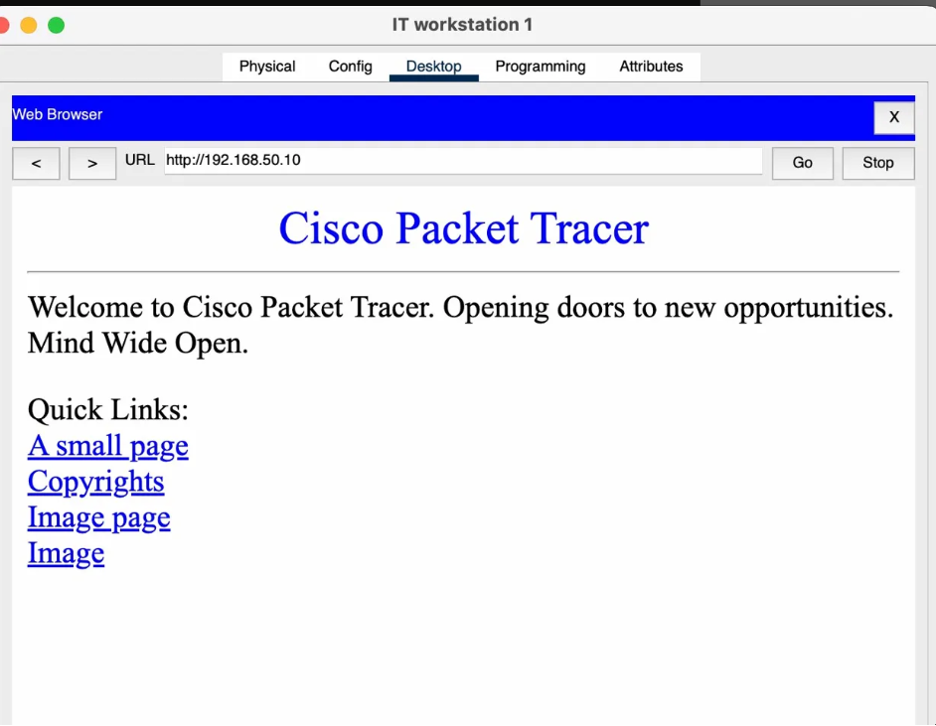
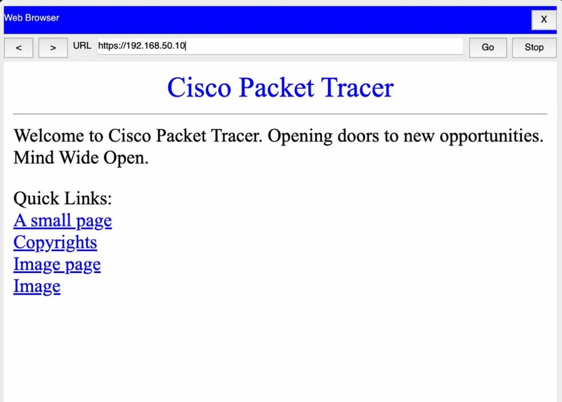
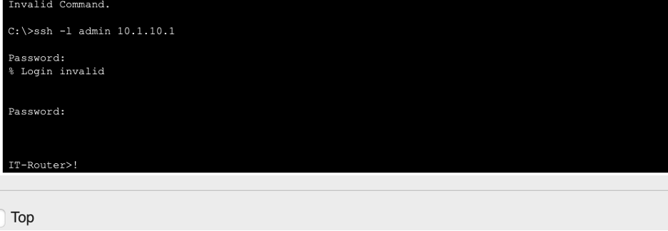
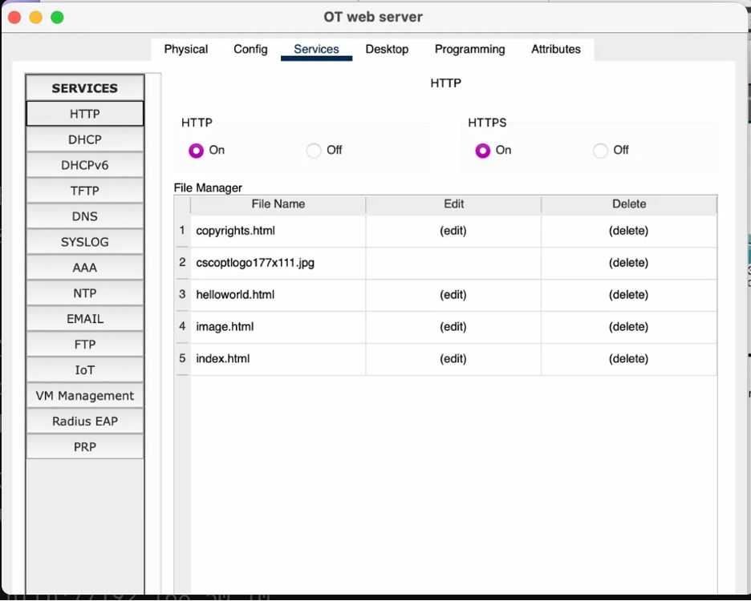
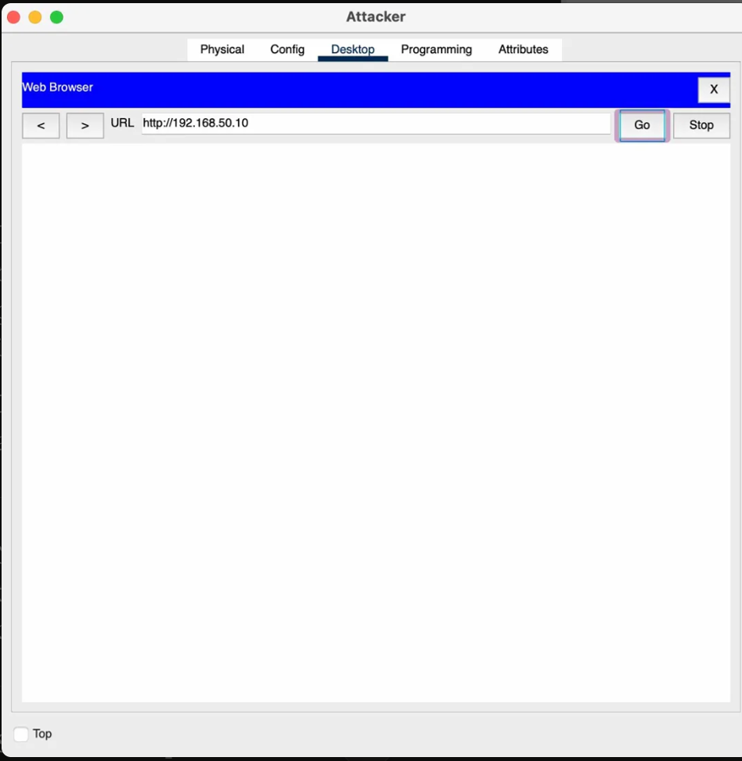

# WBMUD Enterprise LAN Security Assessment

**Student:** Ashley Velasquez
**Course:** IT 520
**Lab:** Lab 04 - Enterprise LAN Security Assessment
**Date:** March 31, 2026
**Institution:** Marymount University

---

## Part 1: Network Architecture & Topology

### Overview
The WBMUD network was designed as a three-tier segmented architecture separating IT Operations, Operational Technology (OT), and Remote Pump Station environments.

### Network Segments

| Segment | IP Range | Key Devices |
|---|---|---|
| IT Operations | 10.1.10.0/24 | IT-Router, IT-Switch, 2 Workstations |
| OT Network | 192.168.50.0/24 | OT-Router, OT-Switch, Web Server, 2 SCADA Devices |
| Remote Pump Station | 172.16.5.0/24 | Remote-Router, Remote-Switch, Pump Controller |
| DMZ (Attacker) | 203.0.113.100 | Simulated external threat actor |

### OSI Layer Mapping

**Layer 1 (Physical):** All devices were connected using copper straight-through cables for end device to switch connections, and serial cables for WAN router-to-router links. Physical cabling represents Layer 1 because it deals with the actual transmission of raw bits over a physical medium.

**Layer 2 (Data Link):** Switches operate at Layer 2 by using MAC addresses to forward frames between devices on the same network segment. Each switch maintains a MAC address table mapping device MAC addresses to specific switch ports.

**Layer 3 (Network):** Routers operate at Layer 3 by using IP addresses to route packets between different network segments. Static routes were configured on all three routers to enable inter-network communication.



---

## Part 2: Protocol Security Analysis

### Step 2.1: Transport Layer Security (OSI Layer 4)

TCP uses a three-way handshake (SYN → SYN-ACK → ACK) to establish a verified connection before any data is transmitted. This provides security visibility because network monitoring tools can track connection states and detect unauthorized connection attempts. UDP is connectionless and sends data without establishing a session, providing much less security visibility.



### Step 2.2: Application Layer Security (OSI Layer 7)

**HTTP vs HTTPS:**
HTTP transmits all data in plaintext over port 80, allowing attackers to intercept and read all traffic including credentials. HTTPS uses TLS/SSL encryption over port 443, making intercepted traffic unreadable. In a critical infrastructure environment like WBMUD, HTTPS is essential for any web-based management interfaces.




**SSH vs Telnet:**
SSH replaced Telnet because Telnet transmits all data including passwords in cleartext. SSH encrypts the entire session using strong cryptography, protecting credentials and commands from interception.



---

## Part 3: Shellshock Vulnerability Assessment

### Vulnerability Background
Shellshock (CVE-2014-6271, CERT/CC VU#252743) is a critical vulnerability in GNU Bash that allows remote code execution through specially crafted environment variables.

### LAMP Server Configuration
The OT Web Server (192.168.50.10) runs Apache on ports 80 and 443 with CGI enabled.



### Shellshock Exploit Simulation
The following malicious HTTP request simulates the Shellshock attack from attacker node (203.0.113.100):
```bash
curl -A "() { :; }; echo 'Shellshock Vulnerable'" http://192.168.50.10/cgi-bin/test.cgi
```



### Attack Analysis

**Exploitation Path:**
The attacker sends a malicious HTTP request with a crafted User-Agent header. Apache passes this to a CGI script invoking Bash. The vulnerable Bash version executes the injected command with Apache's privileges, giving the attacker remote code execution.

**LAMP Stack Connection:**
- Linux — the OS running Bash
- Apache — passes HTTP headers to CGI scripts
- Bash — the vulnerable component that executes injected commands
- PHP/MySQL are not directly involved in this exploit

**Impact Assessment:**
An attacker with RCE on the OT web server could read SCADA configuration files, pivot to SCADA-Device1 and SCADA-Device2, manipulate water treatment controls, and exfiltrate sensitive operational data.

**Mitigation Strategies:**
- Update Bash to a patched version (4.3 patch 25 or later)
- Deploy a Web Application Firewall to block malicious headers
- Isolate the OT network from direct internet access using strict firewall rules

**CERT/CC Role:**
CERT/CC (VU#252743) coordinated disclosure between Bash developers and vendors, issued public advisories, and tracked patch distribution to ensure organizations worldwide could remediate the vulnerability quickly.

---

## Part 4: Incident Response

### Incident Summary
On March 15, 2026 at 02:47 AM EST, WBMUD's SOC detected unauthorized access from 203.0.113.100, resulting in 2.3 GB data exfiltration and unauthorized SSH sessions to SCADA devices.

### Attack Path Reconstruction

**Initial Access:** Attacker exploited Shellshock via HTTP port 80 on OT web server (192.168.50.10).

**Privilege Escalation:** Attacker gained Apache user privileges then escalated to root via local exploit.

**Lateral Movement:** Used SSH to connect to SCADA-Device1 (192.168.50.20) and SCADA-Device2 (192.168.50.21) using credentials obtained from the web server.

**Data Exfiltration:** 2.3 GB transferred from SCADA devices → OT-Web-Server → OT-Router → IT-Router → external attacker IP.


### Root Cause Analysis

| Vulnerability Category | What Went Wrong | Security Control That Was Missing |
|---|---|---|
| Unpatched Software | OT web server ran vulnerable Bash version susceptible to Shellshock (CVE-2014-6271) | Automated patch management with vulnerability scanning to remediate CVEs within 30 days |
| Network Segmentation | No firewall rules prevented internet access to OT web server; no isolation between web server and SCADA devices | DMZ architecture separating web server from SCADA devices with restrictive firewall rules |
| Access Controls | SCADA devices used shared credentials obtainable from compromised web server | Unique strong credentials per device, principle of least privilege, MFA for all admin access |
| Monitoring & Detection | 2.3 GB exfiltration occurred undetected; log tampering went unnoticed | SIEM with real-time alerts for anomalous transfers, failed logins, and log integrity monitoring |

### Remediation Plan

**1. Immediate Containment (0-24 hours):**
Isolate OT network at router level, reset all credentials, capture forensic images, terminate all active sessions, notify regulatory bodies.

**2. Short-Term Fixes (1-7 days):**
Patch all systems for Shellshock, implement firewall rules blocking internet access to OT, enable centralized tamper-evident logging, deploy WAF, change all default passwords.

**3. Long-Term Improvements (1-3 months):**
Redesign OT network with DMZ architecture, implement zero trust principles, enforce least privilege, deploy network micro-segmentation to prevent lateral movement.

**4. Monitoring & Detection:**
Implement SIEM with real-time alerts for anomalous data transfers, failed authentication, new SSH connections between OT devices, and log file changes. Deploy IDS on OT network traffic.

**5. Organizational Improvements:**
Establish formal patch management policy requiring CVE remediation within 30 days. Implement mandatory cybersecurity training for IT and OT staff. Create and test incident response playbooks. Establish change control procedures for all OT system modifications.

---

## Part 5: OSI Model Mapping Summary

| OSI Layer | Layer Name | Lab Activity |
|---|---|---|
| Layer 1 | Physical | Copper cables connecting all devices, serial WAN links |
| Layer 2 | Data Link | Switch MAC address tables, frame forwarding |
| Layer 3 | Network | IP addressing, static routing between IT/OT/Remote |
| Layer 4 | Transport | TCP (HTTP port 80), UDP (SNMP port 161) |
| Layer 5 | Session | SSH session establishment and management |
| Layer 6 | Presentation | TLS/SSL encryption for HTTPS |
| Layer 7 | Application | HTTP, HTTPS, SSH protocols |

---

## Reflection

This lab provided valuable hands-on experience connecting theoretical network security concepts to practical implementation. Building the WBMUD three-tier network topology demonstrated how physical infrastructure decisions directly impact security posture. Placing IT, OT, and Remote networks on separate subnets with dedicated routers creates natural security boundaries that limit an attacker's ability to move freely through the network.

The protocol security analysis reinforced why protocol selection matters enormously in critical infrastructure environments. Seeing HTTP traffic transmitted in plaintext versus HTTPS encryption made the risk tangible, in a water treatment facility, an attacker intercepting unencrypted SCADA communications could gain detailed knowledge of operational processes. Similarly, the SSH configuration exercise demonstrated why legacy protocols like Telnet have no place in modern enterprise environments.

The Shellshock simulation was perhaps the most impactful component of this lab. Understanding how a single unpatched vulnerability in the Bash shell could provide a complete pathway from external attacker to SCADA system control illustrated the interconnected nature of software dependencies. A water utility operator might not immediately connect their web server's shell version to the safety of their treatment processes, but this lab made that connection clear.

The incident response exercise tied everything together by showing that security is not just about prevention but also detection, containment, and recovery. The root cause analysis revealed that the incident resulted from multiple simultaneous failures — unpatched software, poor network segmentation, weak access controls, and inadequate monitoring. This reinforced the core lesson that effective security requires defense-in-depth: layered controls so that no single failure leads to catastrophic compromise. For critical infrastructure like water systems serving over a million residents, this layered approach is not optional, it is essential.